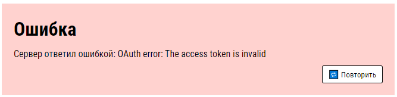

# Тестовое задание для Workle

### Задание

1. Сверстать страницу по [макету](https://www.figma.com/file/TSike5vJs4oQSbAAh13oZ0/WTZ).
2. Добавить функционал: 
	- Брать данные через API сайта [Unsplash.com](api.unsplash.com).
	- При клике по автору в отдельной вкладке открывается его профиль.
	- При клике по фото ничего не происходит.

### Инструменты

Для исполнения данного задания необходимо использовать фреймворк [Vue.js](https://vuejs.org/)

### Структура

```bash
public
├─── favicon.ico
└─── index.html
src
├─── App.vue
├─── main.js
├─── assets
│    ├─── fonts
│    │    ├─── fonts.css
│    │    ├─── RobotoCondensed-Bold.svg
│    │    ├─── RobotoCondensed-Bold.ttf
│    │    ├─── RobotoCondensed-Bold.woff
│    │    ├─── RobotoCondensed-Regular.svg
│    │    ├─── RobotoCondensed-Regular.ttf
│    │    └─── RobotoCondensed-Regular.woff
│    └─── img
│         ├─── eye.svg
│         └─── loading.png
└─── components
     ├─── Error
     │    └─── Error.vue
     ├─── Loading
     │    └─── Loading.vue
     ├─── Pagenation
     │    └─── Pagenation.vue
     └─── Post
          ├─── Autor.vue
          ├─── Post.vue
          └─── Views.vue
```

### Дополнения

В качестве повышения эргономичности интерфейса были добавлены следующие функции, которые не входили в основное задание и по желанию их можно отключить:

- Колёсико загрузки — отображает, что на данный момент система не зависла, а происходит внутреннее действие.
<p align="center">

</p>

- Сообщение о произошедшей ошибке — отображает, что при исполнении задачи произошла ошибка и пользователю предоставляется возможность повторить действие.
<p align="center"> 

</p>

Для того, чтобы отключить то или иное дополнение в файле App.vue необходимо выставить значения false у showLoadingWheel или showUserErrorMessage.

**Примечание**: если отключить отображение ошибки у пользователя, то ошибка выводится в консоли.

### Скриншоты выполненного задания

##### 1000+
<p align="center"> 
	
</p>


##### 768+
<p align="center"> 
	
</p>


##### 480+
<p align="center"> 
	
</p>


##### 320+
<p align="center"> 
	
</p>
### Дополнительные инструменты

Для достижения конечного результата были использованы также следующие инструменты:

- [Babel](https://babeljs.io/)
- [Webpack](https://webpack.js.org/)
- [Vue CLI](https://cli.vuejs.org/)